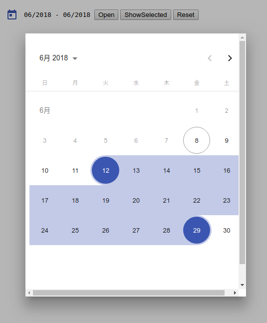

# NgRangeCalendar
NgRangeCalendar is a library based on [SaturnDatepicker](https://github.com/SaturnTeam/saturn-datepicker) and [Angular Material Datepicker](https://material.angular.io/components/component/datepicker)



## Dependence

Your project must install 

- [Angular Material](https://material.angular.io/guide/getting-started)
- [Moment](http://momentjs.com/)


```bash
npm i -S @angular/animations@^5.2.4 @angular/cdk@^5.2.4 @angular/material-moment-adapter@^6.2.1 moment
```

## Install

```bash

npm i ng-range-calendar -S

```

## Basic Usage

```js
import { NgRangeCalendarModule } from './modules/ng-range-calendar/ng-range-calendar.module';

@NgModule({
  imports: [
    NgRangeCalendarModule,
    
    // ...
  ],
  
  // ...
})
```

## Localize

Eg: Japanese Calendar

```js
import { MAT_DATE_LOCALE } from '@angular/material/core';

@NgModule({
  providers: [
      {provide: MAT_DATE_LOCALE, useValue: 'ja-JP'},
  ],
})
```

## Format

We can define display format look like this:

```js
import { MAT_DATE_FORMATS } from '@angular/material/core';

export const MY_FORMATS = {
    parse: {
        dateInput: 'MM/YYYY',
    },
    display: {
        dateInput: 'MM/YYYY',
        monthYearLabel: 'MMM YYYY',
        dateA11yLabel: 'LL',
        monthYearA11yLabel: 'MMMM YYYY',
    },
};

@NgModule({
  providers: [
      {provide: MAT_DATE_FORMATS, useValue: MY_FORMATS},
  ],
})
```

## Running the Sample

```bash

git clone https://github.com/hungnt167/ng-range-calendar
cd ng-range-calendar
npm i
npm start


```

## Cheer :v
